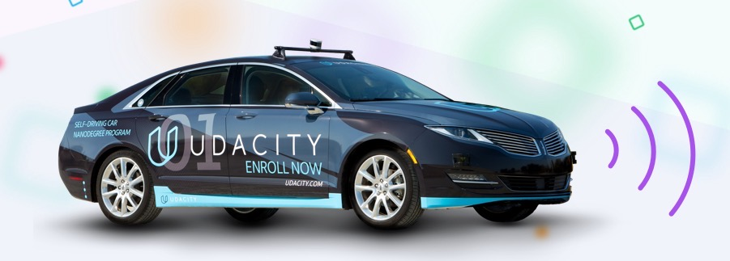

# Udacity_Intro_To_Self_Driving_Car
This repository contains all projects and relevent exercise of the Udacity Inro To self driving cars NanoDegree

## Chapters
The Course contains are segregated into the following.

1. Orientation
2. Bayesian Thinking 
3. Working With Matrices 
4. C++ Basics 
5. Performance Programming in C++
6. Navigating Data Structure
7. Career Service 
8. Vehicle Motion and Control
9. Computer Vision And Machine Learning

## Projects
##### 1. JoyRide - Parrallel Parking

